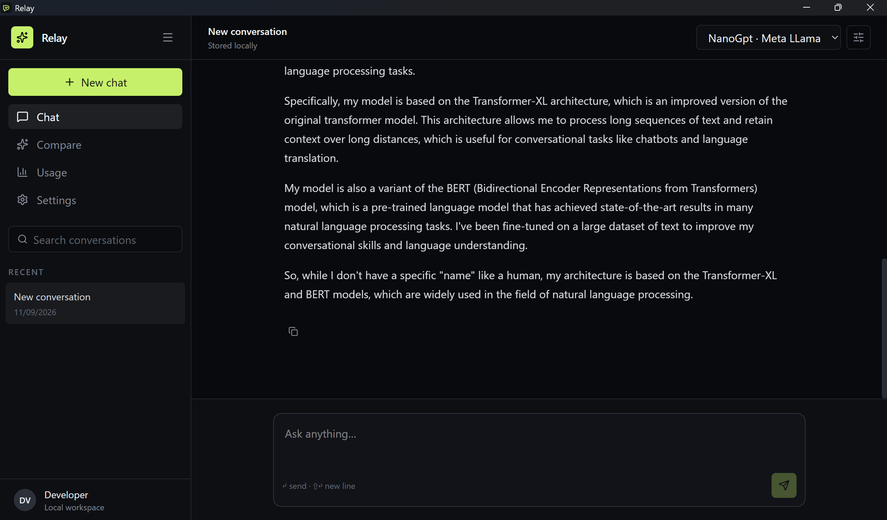

# Relay

Relay is a local-first desktop workspace for chatting with and comparing OpenAI-compatible language models. It uses a React/Vite renderer inside Tauri, a Rust backend for provider traffic, SQLite for durable history and metrics, and the operating system credential vault for API keys.

## Highlights

- Real SSE streaming from the Rust backend, with Stop Generation support
- Concurrent side-by-side model comparison with isolated failures
- Local conversations, messages, generation attempts, and usage telemetry
- Configurable per-million-token pricing and estimated cost reporting
- API keys stored in Windows Credential Manager—not SQLite or browser storage
- Import/export through native file dialogs; backup files deliberately exclude credentials
- Restored window size/position and desktop shortcuts
- HTTPS-only provider endpoints, redirect denial, DNS resolution checks, and private-address blocking
- Sanitized Markdown, GFM, and syntax-highlighted code

## Screenshots

### Chat workspace



Relay keeps conversation history locally while streaming responses through the native Rust backend.

## Tech stack

- Tauri 2 and Rust
- React 19, TypeScript strict mode, Vite 7, Tailwind CSS 4
- SQLite via `rusqlite`
- Windows Credential Manager via `keyring`
- `reqwest`/Rustls for provider connections

## Development setup

Requirements on Windows:

- Node.js 22+
- Rust stable (`rustup`)
- Visual Studio 2022 Build Tools with the Desktop development with C++ workload
- Microsoft Edge WebView2 runtime

```powershell
npm install
npm run desktop
```

The browser-only renderer remains useful for visual work with `npm run dev`, but native storage and generation require `npm run desktop`.

## Commands

```text
npm run dev            Vite renderer
npm run build          Type-check and build the renderer
npm run desktop        Run the Tauri application
npm run desktop:build  Create a production Windows bundle
npm run lint           Lint TypeScript and React
npm run typecheck      TypeScript strict-mode check
npm test               Rust backend tests
```

## Desktop shortcuts

- `Ctrl+N`: new conversation
- `Ctrl+B`: collapse or expand the sidebar
- `Ctrl+,`: open Settings

## Provider setup

Open Settings, add an HTTPS OpenAI-compatible base URL and API key, then add one or more model identifiers and their optional input/output prices. The application stores only a masked key marker in SQLite. Imported backups require API keys to be entered again.

## Data locations

Tauri stores `relay.sqlite3` in the platform application-data directory for `dev.valensco.relay`. Secrets live separately in the operating system credential vault. Native backups are ordinary SQLite snapshots and never include vault credentials.

## Security

Provider requests never pass through the WebView. Rust resolves provider hostnames before connecting and rejects loopback, private, link-local, broadcast, and unspecified addresses. Only HTTPS is accepted, redirects are disabled, authorization headers cannot be overridden by custom headers, rendered Markdown is sanitized, and errors do not contain API keys.

DNS rebinding protection is best-effort because resolution and connection are separate operations in the current `reqwest` integration. A hardened enterprise release should pin the validated address for the request.

## Architecture and limitations

See [docs/ARCHITECTURE.md](docs/ARCHITECTURE.md) for the command/event flow, schema rationale, failure model, and interview notes.

Relay currently supports OpenAI-compatible chat-completions streaming on Windows. Native Anthropic/Google adapters, authentication and sync, attachments, branching, tools/MCP, RAG, web search, routing, and automatic failover remain future work rather than mocked features.
